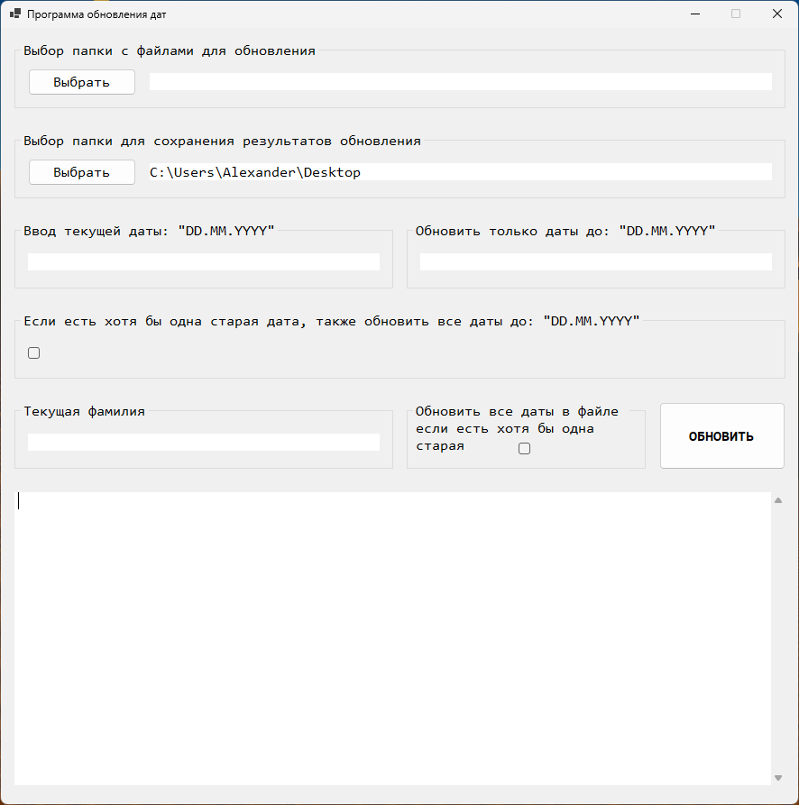

# UpdatingDate Application
 The purpose of this program is to check and update dates and data (last name) in all Excel files in the selected folder. \
 \
 The dates and data in the file are updated according to the settings in the program window. 
 A TextBox is located at the bottom of the program window, which displays a message about the successful completion 
 of the work or a list of errors that have occurred.
\
